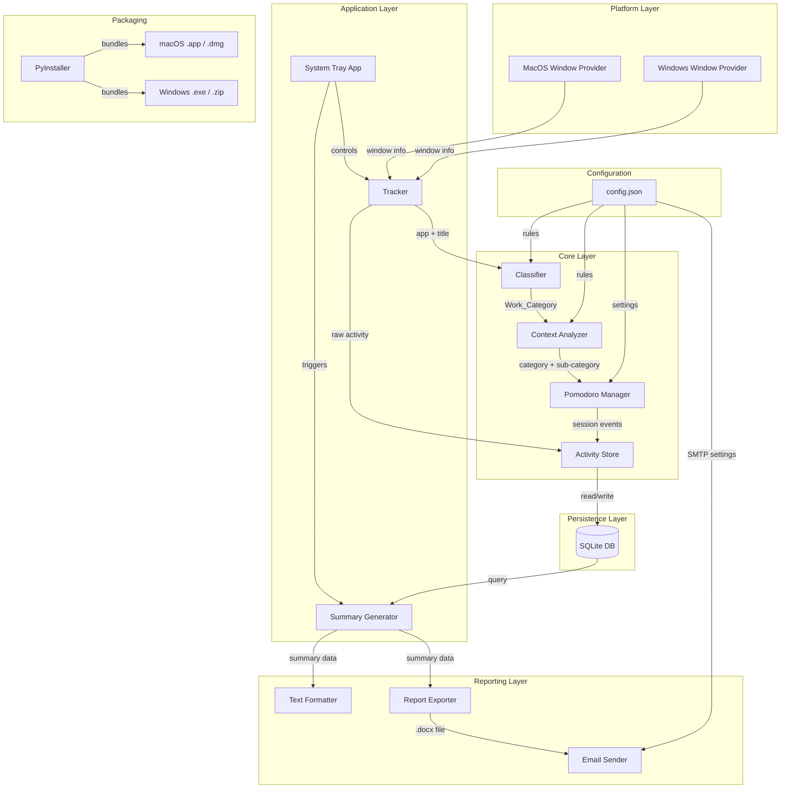

# Design Document: FlowTrack

## Overview

FlowTrack is a cross-platform (macOS and Windows) productivity tracking application built in Python. It monitors the user's active window, classifies activities into configurable work categories with in-app context awareness, manages Pomodoro sessions that automatically adapt to context switches, persists all data in a local SQLite database, and generates daily/weekly summaries with optional Word document export and email delivery.

The application follows a modular architecture with clear separation between platform-specific window polling, classification logic, Pomodoro state management, data persistence, and reporting. This design enables testability, cross-platform support, and extensibility. The application is packaged as a standalone downloadable desktop app using PyInstaller, with a system tray interface for background operation.

## Architecture



The architecture consists of four layers:

1. **Platform Layer**: Abstracts OS-specific window polling behind a common `WindowProvider` interface. Each platform has its own implementation (AppleScript for macOS, Win32 API for Windows).

2. **Core Layer**: Contains the business logic — the Tracker orchestrates polling, the Classifier maps activities to categories, the Context Analyzer refines categories with sub-categories, and the Pomodoro Manager handles session lifecycle with debounce-based context switch detection.

3. **Persistence Layer**: A single SQLite database stores Activity_Logs and Pomodoro_Sessions via the Activity Store, which provides a clean read/write API.

4. **Reporting Layer**: The Summary Generator queries the store and produces structured summary data. The Text Formatter renders it as plain text. The Report Exporter generates Word documents, and the Email Sender handles delivery.

## Components and Interfaces

### WindowProvider (Abstract Interface)

```python
from abc import ABC, abstractmethod
from dataclasses import dataclass
from typing import Optional

@dataclass
class WindowInfo:
    app_name: str
    window_title: str

class WindowProvider(ABC):
    @abstractmethod
    def get_active_window(self) -> Optional[WindowInfo]:
        """Return the currently active window info, or None if unavailable."""
        pass

    @abstractmethod
    def is_user_idle(self) -> bool:
        """Return True if the screen is locked or system is idle."""
        pass
```

- `MacOSWindowProvider`: Uses `osascript` (AppleScript) to query the frontmost application and window title. Detects idle via `ioreg` idle time.
- `WindowsWindowProvider`: Uses `ctypes` with `user32.dll` (`GetForegroundWindow`, `GetWindowText`) for window info. Detects idle via `GetLastInputInfo`.

### Classifier

```python
@dataclass
class ClassificationRule:
    app_patterns: list[str]       # regex patterns for app name
    title_patterns: list[str]     # regex patterns for window title
    category: str                 # target Work_Category

class Classifier:
    def __init__(self, rules: list[ClassificationRule]):
        self.rules = rules

    def classify(self, app_name: str, window_title: str) -> str:
        """Return the Work_Category for the given app and title.
        Returns 'Other' if no rule matches."""
        pass

    @staticmethod
    def load_rules(path: str) -> list[ClassificationRule]:
        """Deserialize rules from JSON config file."""
        pass

    @staticmethod
    def save_rules(rules: list[ClassificationRule], path: str) -> None:
        """Serialize rules to JSON config file."""
        pass
```

Rules are evaluated in order; the first matching rule wins. Each rule can match on app name, window title, or both using regex patterns.

### Context Analyzer

```python
@dataclass
class ContextResult:
    category: str          # Work_Category from Classifier
    sub_category: str      # refined sub-category (e.g., "Contract Draft")
    context_label: str     # human-readable label (e.g., "Contract Draft: Smith v. Jones")

@dataclass
class ContextRule:
    category: str              # applies to this Work_Category
    title_patterns: list[str]  # regex patterns with named groups
    sub_category: str          # resulting sub-category

class ContextAnalyzer:
    def __init__(self, rules: list[ContextRule]):
        self.rules = rules

    def analyze(self, app_name: str, window_title: str, category: str) -> ContextResult:
        """Refine a Work_Category into a sub-category based on window title patterns.
        Falls back to category as sub_category if no rule matches."""
        pass
```

### Pomodoro Manager

```python
from enum import Enum
from datetime import datetime, timedelta

class SessionStatus(Enum):
    ACTIVE = "active"
    PAUSED = "paused"
    COMPLETED = "completed"
    BREAK = "break"

@dataclass
class PomodoroSession:
    id: str
    category: str
    sub_category: str
    start_time: datetime
    elapsed: timedelta
    status: SessionStatus
    completed_count: int  # number of completed work intervals in this session

class PomodoroManager:
    WORK_DURATION = timedelta(minutes=25)
    SHORT_BREAK = timedelta(minutes=5)
    LONG_BREAK = timedelta(minutes=15)
    LONG_BREAK_INTERVAL = 4

    def __init__(self, debounce_seconds: int = 30):
        self.debounce_threshold = timedelta(seconds=debounce_seconds)
        self.active_session: Optional[PomodoroSession] = None
        self.paused_sessions: dict[str, PomodoroSession] = {}  # keyed by category
        self.pending_switch: Optional[tuple[str, str, datetime]] = None  # (category, sub_cat, detected_at)

    def on_activity(self, category: str, sub_category: str, timestamp: datetime) -> list[str]:
        """Process an activity observation. Returns list of events that occurred
        (e.g., 'session_started', 'session_paused', 'context_switch_pending', 'switch_cancelled')."""
        pass

    def tick(self, now: datetime) -> list[str]:
        """Advance timer state. Called periodically. Returns events like
        'work_completed', 'break_started', 'break_completed'."""
        pass

    def get_break_duration(self, completed_count: int) -> timedelta:
        """Return short or long break based on completed count."""
        if completed_count > 0 and completed_count % self.LONG_BREAK_INTERVAL == 0:
            return self.LONG_BREAK
        return self.SHORT_BREAK
```

Key behaviors:
- When a new category is detected, a debounce timer starts. If the category persists past the threshold, the current session is paused and a new one starts (or a previously paused session for that category resumes).
- If the category reverts before the debounce expires, the pending switch is cancelled.
- The `tick()` method handles work interval completion and break transitions.

### Tracker (Orchestrator)

```python
class Tracker:
    def __init__(self, window_provider: WindowProvider, classifier: Classifier,
                 context_analyzer: ContextAnalyzer, pomodoro_manager: PomodoroManager,
                 store: ActivityStore, poll_interval: int = 5):
        self.window_provider = window_provider
        self.classifier = classifier
        self.context_analyzer = context_analyzer
        self.pomodoro_manager = pomodoro_manager
        self.store = store
        self.poll_interval = poll_interval

    def poll_once(self, now: datetime) -> None:
        """Execute a single poll cycle: get window, classify, analyze context,
        update pomodoro, persist activity log."""
        pass

    def run(self) -> None:
        """Main loop: poll at configured interval, skip when idle."""
        pass
```

### Activity Store

```python
@dataclass
class ActivityRecord:
    id: int
    timestamp: datetime
    app_name: str
    window_title: str
    category: str
    sub_category: str
    session_id: Optional[str]

class ActivityStore:
    def __init__(self, db_path: str):
        self.db_path = db_path

    def init_db(self) -> None:
        """Create tables if they don't exist."""
        pass

    def save_activity(self, record: ActivityRecord) -> None:
        pass

    def save_session(self, session: PomodoroSession) -> None:
        pass

    def get_activities(self, start: datetime, end: datetime) -> list[ActivityRecord]:
        pass

    def get_sessions(self, start: datetime, end: datetime) -> list[PomodoroSession]:
        pass

    def get_activity_by_id(self, record_id: int) -> Optional[ActivityRecord]:
        pass
```

### Summary Generator

```python
@dataclass
class CategorySummary:
    category: str
    sub_categories: dict[str, timedelta]  # sub_category -> time spent
    total_time: timedelta
    completed_sessions: int

@dataclass
class DailySummary:
    date: date
    categories: list[CategorySummary]  # sorted by total_time descending
    total_time: timedelta
    total_sessions: int

@dataclass
class WeeklySummary:
    start_date: date
    end_date: date
    daily_breakdowns: list[DailySummary]
    categories: list[CategorySummary]  # aggregated for the week
    total_time: timedelta
    total_sessions: int

class SummaryGenerator:
    def __init__(self, store: ActivityStore):
        self.store = store

    def daily_summary(self, target_date: date) -> DailySummary:
        pass

    def weekly_summary(self, start_date: date) -> WeeklySummary:
        pass
```

### Text Formatter

```python
class TextFormatter:
    @staticmethod
    def format_duration(duration: timedelta) -> str:
        """Format a timedelta as 'Xh Ym' (e.g., '2h 15m')."""
        pass

    @staticmethod
    def parse_duration(text: str) -> timedelta:
        """Parse 'Xh Ym' back to timedelta."""
        pass

    @staticmethod
    def format_daily(summary: DailySummary) -> str:
        """Render a daily summary as aligned plain text."""
        pass

    @staticmethod
    def format_weekly(summary: WeeklySummary) -> str:
        """Render a weekly summary as aligned plain text."""
        pass
```

### Report Exporter

```python
class ReportExporter:
    def export_weekly(self, summary: WeeklySummary, user_name: str, output_path: str) -> str:
        """Generate a .docx file from weekly summary data.
        Returns the path to the generated file."""
        pass
```

Uses `python-docx` to create a formatted Word document with a title page, category tables, and day-by-day breakdown.

### Email Sender

```python
@dataclass
class SmtpConfig:
    server: str
    port: int
    username: str
    password: str
    use_tls: bool

class EmailSender:
    def __init__(self, config: SmtpConfig):
        self.config = config

    def send(self, to_address: str, subject: str, body: str, attachment_path: str) -> bool:
        """Send an email with the .docx attachment. Returns True on success."""
        pass
```

Uses Python's `smtplib` and `email` standard library modules.

### System Tray Application

```python
class FlowTrackApp:
    """Main application class that runs FlowTrack as a system tray app."""

    def __init__(self, config_path: str):
        self.config = load_config(config_path)
        self.tracker: Optional[Tracker] = None
        self.tray_icon = None

    def start(self) -> None:
        """Initialize all components, start the tracker in a background thread,
        and display the system tray icon."""
        pass

    def stop(self) -> None:
        """Stop tracking and clean up resources."""
        pass

    def show_daily_summary(self) -> None:
        """Display today's summary in a notification or popup."""
        pass

    def show_weekly_summary(self) -> None:
        """Generate and display/export the weekly summary."""
        pass

    def open_settings(self) -> None:
        """Open the settings UI window."""
        pass

    def add_manual_task(self) -> None:
        """Prompt user to create a manual Pomodoro task."""
        pass
```

Uses [pystray](https://github.com/moses-palmer/pystray) for cross-platform system tray support (macOS and Windows). The tray icon provides a menu with:
- Start/Stop tracking
- View daily summary
- Generate weekly report
- Add manual task
- Settings
- Quit

### Settings UI

```python
class SettingsWindow:
    """Tabbed settings window built with tkinter for cross-platform GUI support."""

    def __init__(self, config: dict, on_save: Callable[[dict], None]):
        self.config = config
        self.on_save = on_save

    def show(self) -> None:
        """Display the settings window with tabs."""
        pass

    def _build_email_tab(self, parent) -> None:
        """Email configuration: SMTP server, port, TLS, credentials, recipient.
        Includes a 'Test Connection' button."""
        pass

    def _build_categories_tab(self, parent) -> None:
        """Work category management: add/edit/remove categories and their
        keyword rules (app patterns, title patterns)."""
        pass

    def _build_context_rules_tab(self, parent) -> None:
        """Context rule management: add/edit/remove sub-category patterns
        per Work_Category."""
        pass

    def _build_pomodoro_tab(self, parent) -> None:
        """Pomodoro settings: work duration, break durations, debounce threshold.
        Also allows creating a manual Pomodoro task with custom category/label."""
        pass

    def _save(self) -> None:
        """Validate inputs, persist to config.json, and call on_save callback
        to apply changes to running components."""
        pass
```

Uses Python's built-in `tkinter` for the GUI — no additional dependencies needed, and it works on both macOS and Windows. The `ttk.Notebook` widget provides the tabbed interface.

**Design Principles**:
- Minimalistic, clean aesthetic with ample whitespace and muted colors
- Flat design with no unnecessary borders, shadows, or decorations
- Monochrome icon set; accent color used sparingly for active states only
- System-native font (San Francisco on macOS, Segoe UI on Windows) at comfortable sizes
- Each tab shows only essential fields — advanced options hidden behind a "More" toggle
- Summary popups use simple card-style layout with large numbers and thin dividers
- Notifications are brief, non-intrusive toasts from the system tray
- Custom `ttk.Style` theme overrides default tkinter look to achieve the minimal feel

### Packaging and Distribution

The application is packaged as a standalone executable using [PyInstaller](https://pyinstaller.org/):

- **macOS**: Produces a `.app` bundle inside a `.dmg` disk image
- **Windows**: Produces a `.exe` installer via PyInstaller + [NSIS](https://nsis.sourceforge.io/) or a single-folder distribution as a `.zip`

Build commands:
```bash
# macOS
pyinstaller --windowed --name FlowTrack --icon assets/icon.icns flowtrack/main.py

# Windows
pyinstaller --windowed --name FlowTrack --icon assets/icon.ico flowtrack/main.py
```

The packaged app:
- Runs as a background process with a system tray icon
- Bundles all Python dependencies (no Python installation required)
- Stores data in platform-appropriate locations (`~/Library/Application Support/FlowTrack` on macOS, `%APPDATA%/FlowTrack` on Windows)
- Auto-creates default config.json on first launch

## Data Models

### SQLite Schema

```sql
CREATE TABLE IF NOT EXISTS activity_logs (
    id INTEGER PRIMARY KEY AUTOINCREMENT,
    timestamp TEXT NOT NULL,          -- ISO 8601 format
    app_name TEXT NOT NULL,
    window_title TEXT NOT NULL,
    category TEXT NOT NULL,
    sub_category TEXT NOT NULL DEFAULT '',
    session_id TEXT
);

CREATE TABLE IF NOT EXISTS pomodoro_sessions (
    id TEXT PRIMARY KEY,
    category TEXT NOT NULL,
    sub_category TEXT NOT NULL DEFAULT '',
    start_time TEXT NOT NULL,         -- ISO 8601 format
    elapsed_seconds REAL NOT NULL,
    status TEXT NOT NULL,             -- 'active', 'paused', 'completed', 'break'
    completed_count INTEGER NOT NULL DEFAULT 0
);

CREATE INDEX IF NOT EXISTS idx_activity_timestamp ON activity_logs(timestamp);
CREATE INDEX IF NOT EXISTS idx_session_start ON pomodoro_sessions(start_time);
```

### Configuration File (config.json)

```json
{
  "poll_interval_seconds": 5,
  "debounce_threshold_seconds": 30,
  "classification_rules": [
    {
      "app_patterns": ["Microsoft Word", "Google Docs", "Pages"],
      "title_patterns": [],
      "category": "Document Editing"
    },
    {
      "app_patterns": ["Outlook", "Gmail", "Thunderbird", "Mail"],
      "title_patterns": [],
      "category": "Email & Communication"
    },
    {
      "app_patterns": ["Zoom", "Teams", "Webex", "Google Meet"],
      "title_patterns": [],
      "category": "Meetings"
    },
    {
      "app_patterns": ["Chrome", "Firefox", "Safari", "Edge"],
      "title_patterns": [".*"],
      "category": "Research & Browsing"
    }
  ],
  "context_rules": [
    {
      "category": "Document Editing",
      "title_patterns": ["(?i)contract|agreement|nda"],
      "sub_category": "Contract Draft"
    },
    {
      "category": "Document Editing",
      "title_patterns": ["(?i)meeting.*notes|minutes"],
      "sub_category": "Meeting Notes"
    },
    {
      "category": "Document Editing",
      "title_patterns": ["(?i)design|spec|proposal"],
      "sub_category": "Design Brief"
    }
  ],
  "pomodoro": {
    "work_minutes": 25,
    "short_break_minutes": 5,
    "long_break_minutes": 15,
    "long_break_interval": 4
  },
  "report": {
    "user_name": "",
    "output_directory": "~/flowtrack-reports",
    "email": {
      "to_address": "",
      "smtp_server": "",
      "smtp_port": 587,
      "smtp_username": "",
      "smtp_password": "",
      "use_tls": true
    }
  },
  "database_path": "~/.flowtrack/flowtrack.db"
}
```

### Data Flow

1. **Polling**: `Tracker.poll_once()` → `WindowProvider.get_active_window()` → `WindowInfo`
2. **Classification**: `WindowInfo` → `Classifier.classify()` → `Work_Category`
3. **Context Analysis**: `(Work_Category, window_title)` → `ContextAnalyzer.analyze()` → `ContextResult`
4. **Pomodoro**: `ContextResult` → `PomodoroManager.on_activity()` → session events
5. **Persistence**: `ActivityRecord` + `PomodoroSession` → `ActivityStore` → SQLite
6. **Reporting**: `ActivityStore` → `SummaryGenerator` → `DailySummary`/`WeeklySummary` → `TextFormatter` or `ReportExporter` → `EmailSender`

## Correctness Properties

*A property is a characteristic or behavior that should hold true across all valid executions of a system — essentially, a formal statement about what the system should do. Properties serve as the bridge between human-readable specifications and machine-verifiable correctness guarantees.*

### Property 1: Classifier always returns exactly one valid category

*For any* application name and window title string, the Classifier SHALL return exactly one Work_Category from the configured set. If the input matches a rule, the returned category is that rule's category; if no rule matches, the returned category is "Other".

**Validates: Requirements 2.1, 2.2, 2.3**

### Property 2: Classification rules JSON round-trip

*For any* valid list of ClassificationRule objects, serializing to JSON then deserializing SHALL produce an equivalent list of rules with identical app_patterns, title_patterns, and category values.

**Validates: Requirements 2.5**

### Property 3: Context Analyzer rule matching

*For any* window title, application name, and Work_Category, if a context rule's pattern matches the window title for that category, the Context_Analyzer SHALL return the rule's sub_category. If no context rule matches, the sub_category SHALL equal the Work_Category.

**Validates: Requirements 9.2, 9.3, 9.4, 9.5, 9.6**

### Property 4: Break duration follows Pomodoro intervals

*For any* non-negative completed session count, the break duration SHALL be 15 minutes (long break) when the count is a positive multiple of 4, and 5 minutes (short break) otherwise.

**Validates: Requirements 3.1**

### Property 5: Work completion triggers break

*For any* active Pomodoro session, when the elapsed time reaches or exceeds 25 minutes, calling `tick()` SHALL transition the session status to break and increment the completed count.

**Validates: Requirements 3.2**

### Property 6: Break completion signals readiness

*For any* Pomodoro session in break status, when the break elapsed time reaches or exceeds the break duration (short or long), calling `tick()` SHALL signal readiness for the next work session.

**Validates: Requirements 3.3**

### Property 7: Debounce prevents premature context switches

*For any* sequence of activity observations where the Work_Category changes and then reverts before the Debounce_Threshold expires, the Pomodoro_Manager SHALL continue the original session without any pause or switch occurring.

**Validates: Requirements 4.1, 4.4**

### Property 8: Context switch after debounce threshold

*For any* sequence of activity observations where a new Work_Category persists beyond the Debounce_Threshold, the Pomodoro_Manager SHALL pause the current session and either start a new session or resume a previously paused session for that category.

**Validates: Requirements 4.2, 4.3**

### Property 9: Session resume preserves state

*For any* Pomodoro session that was paused due to a context switch, when the user returns to that category (after debounce), the resumed session SHALL have the same session ID and accumulated elapsed time as when it was paused.

**Validates: Requirements 4.3**

### Property 10: Activity record database round-trip

*For any* valid ActivityRecord, saving it to the SQLite database then reading it back by ID SHALL produce an equivalent record with identical timestamp, app_name, window_title, category, sub_category, and session_id.

**Validates: Requirements 5.4**

### Property 11: Pomodoro session database round-trip

*For any* valid PomodoroSession, saving it to the SQLite database then reading it back by ID SHALL produce an equivalent session with identical category, sub_category, start_time, elapsed, status, and completed_count.

**Validates: Requirements 5.3**

### Property 12: Daily summary filters by date

*For any* set of activity logs spanning multiple dates, the daily summary for a specific date SHALL only include activities whose timestamps fall within that date (midnight to midnight).

**Validates: Requirements 6.1**

### Property 13: Summary grouping preserves total time

*For any* daily summary, the sum of total_time across all CategorySummary entries SHALL equal the summary's total_time, and the sum of completed_sessions across all entries SHALL equal the summary's total_sessions.

**Validates: Requirements 6.2, 6.3**

### Property 14: Summary categories sorted by time descending

*For any* daily summary with two or more categories, each category's total_time SHALL be greater than or equal to the next category's total_time in the list.

**Validates: Requirements 6.4**

### Property 15: Weekly summary covers exactly 7 days

*For any* weekly summary starting from a given date, the daily_breakdowns list SHALL contain exactly 7 entries, one for each day from start_date to start_date + 6 days.

**Validates: Requirements 7.1**

### Property 16: Weekly totals equal sum of daily breakdowns

*For any* weekly summary, the total_time SHALL equal the sum of all daily breakdown total_times, and total_sessions SHALL equal the sum of all daily breakdown total_sessions.

**Validates: Requirements 7.2, 7.3, 7.4**

### Property 17: Duration format/parse round-trip

*For any* timedelta with non-negative total seconds, formatting it as "Xh Ym" then parsing the resulting string back SHALL produce a timedelta with the same total minutes (seconds are truncated to minutes).

**Validates: Requirements 8.3**

### Property 18: Tracker produces complete activity records

*For any* valid WindowInfo returned by the WindowProvider, the Tracker SHALL produce an ActivityRecord containing a non-empty timestamp, the original app_name, the original window_title, and a valid Work_Category.

**Validates: Requirements 1.2**

## Error Handling

| Scenario | Component | Behavior |
|---|---|---|
| Window API unavailable/error | Tracker | Log error, skip this poll cycle, continue on next interval |
| Screen locked / system idle | Tracker | Pause recording, resume when user active |
| Invalid/empty window title | Classifier | Return "Other" category |
| No matching classification rule | Classifier | Return "Other" category |
| No matching context rule | Context_Analyzer | Fall back to Work_Category as sub_category |
| SQLite write failure | ActivityStore | Log error, retry once, raise if persistent |
| Corrupt/missing database file | ActivityStore | Re-create tables on startup via `init_db()` |
| Invalid config.json | Config loader | Log error, use default configuration |
| SMTP connection failure | EmailSender | Log error, retain .docx locally |
| SMTP authentication failure | EmailSender | Log error, retain .docx locally |
| No email configured | ReportExporter | Save .docx to local output directory |
| python-docx generation failure | ReportExporter | Log error, fall back to plain text export |

## Testing Strategy

### Dual Testing Approach

FlowTrack uses both unit tests and property-based tests for comprehensive coverage:

- **Unit tests**: Verify specific examples, edge cases, error conditions, and integration points
- **Property tests**: Verify universal properties across randomly generated inputs

### Property-Based Testing

- **Library**: [Hypothesis](https://hypothesis.readthedocs.io/) for Python
- **Configuration**: Minimum 100 examples per property test (`@settings(max_examples=100)`)
- **Tagging**: Each property test includes a comment referencing its design property:
  ```python
  # Feature: flowtrack, Property 4: Break duration follows Pomodoro intervals
  ```

### Test Organization

Tests are organized by component:

| Component | Unit Tests | Property Tests |
|---|---|---|
| Classifier | Rule matching examples, edge cases | Property 1 (always one category), Property 2 (JSON round-trip) |
| Context Analyzer | Specific pattern examples | Property 3 (rule matching + fallback) |
| Pomodoro Manager | Timer edge cases, state transitions | Properties 4-9 (intervals, transitions, debounce, resume) |
| Activity Store | DB error handling | Properties 10-11 (round-trip) |
| Summary Generator | Empty data, single-day examples | Properties 12-16 (filtering, grouping, sorting, weekly invariants) |
| Text Formatter | Specific format examples | Property 17 (duration round-trip) |
| Tracker | Idle detection, error recovery | Property 18 (complete records) |
| Report Exporter | Document content verification | Example tests (10.1, 10.2) |
| Email Sender | SMTP error handling | Edge-case tests (10.5) |

### Key Testing Decisions

1. **Hypothesis strategies** will generate random `WindowInfo`, `ClassificationRule`, `ContextRule`, `ActivityRecord`, `PomodoroSession`, and `timedelta` objects
2. **SQLite tests** use in-memory databases (`:memory:`) for speed and isolation
3. **Platform-specific tests** (WindowProvider implementations) are integration tests run only on the target OS
4. **Email tests** use mock SMTP to avoid external dependencies
5. **Report Exporter tests** verify .docx content by reading back with python-docx
